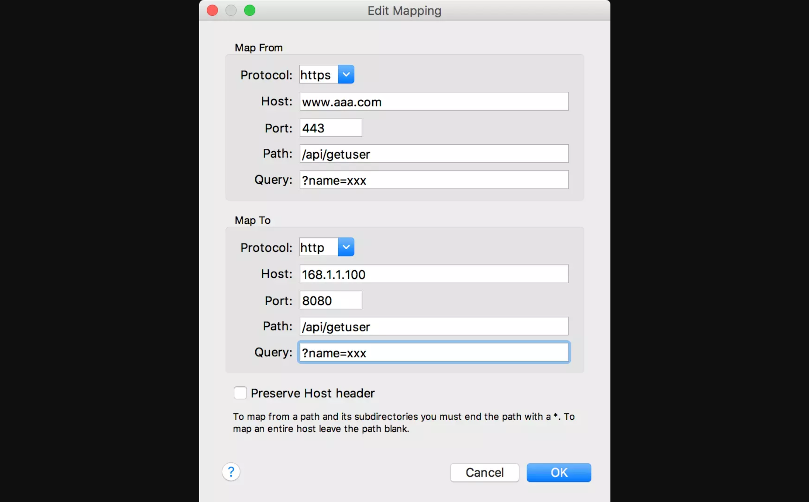

# 调试方法

调试方法这块被考查最多的就是如何进行抓包。

> 题目：如何抓取数据？如何使用工具来配置代理？

PC 端的网页，我们可以通过 Chrome、Firefox 等浏览器自带的开发者工具来查看网页的所有网络请求，以帮助排查 bug。这种监听、查看网络请求的操作称为抓包。

针对移动端的抓包工具，Mac 系统下推荐使用 Charles 这个工具，首先 下载 并安装，打开。Windows 系统推荐使用 Fiddler，下载安装打开。两者使用基本一致，下面以 Charles 为例介绍。

接下来，将安装好 Charles 的电脑和要抓包的手机，连接到同一个网络（一般为公司统一提供的内网，由专业网络工程师搭建），保证 IP 段相同。然后，将手机设置网络代理（每种不同手机如何设置网络代理，网上都有傻瓜式教程），代理的 IP 为电脑的 IP，代理的端口为8888。然后，Charles 可能会有一个弹框提示是否允许连接代理，这里选择“允许”即可。这样，使用手机端访问的网页或者联网的请求，Charles 就能监听到了。

在开发过程中，经常用到抓包工具来做代理，将线上的地址代理到测试环境，Charles 和 Fiddler 都可实现这个功能。以 Charles 为例，点击菜单栏中 Tools 菜单，然后二级菜单中点击 Map Remote，会弹出配置框。首先，选中 Enable Map Remote 复选框，然后点击 Add 按钮，添加一个代理项。例如，如果要将线上的https://www.aaa.com/api/getuser?name=xxx这个地址代理到测试地址http://168.1.1.100:8080/api/getuser?name=xxx，配置如下图

